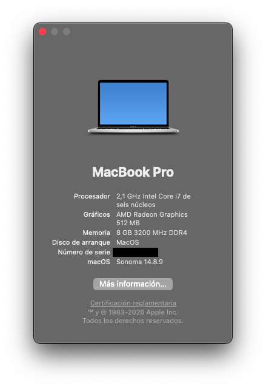

# HP 15-EF2127WM

# Hackintosh Configuration

This repository contains a personal OpenCore EFI configuration for a Hackintosh build based on the HP 15-EF2127WM laptop.

August 9, 2026.

## Hardware Summary

- Laptop: HP 15-EF2127WM
- CPU: AMD Ryzen 5 5500U with Radeon Graphics
- Cores/Threads: 6 cores / 12 threads
- GPU: AMD Radeon Graphics (Renoir)
- RAM: 8 GB DDR4 (2 x 4 GB, Samsung)
- Wi-Fi/Bluetooth: Realtek RTL8822CE 802.11ac PCIe Wireless adapter
- Storage: ADATA SX8200PNP NVMe SSD
- Display: 15.6-inch 1728x1080 eDP panel
- SMBIOS: MacBookPro16,3

OpenCore version: 1.0.7
MacOS version: macOS Sonoma Versión 14.8.9 (Compilation 23J631)




## Project Purpose

This EFI is set up for running macOS with OpenCore on the hardware listed above. It includes the standard ACPI patches, kexts, and boot configuration needed for this specific AMD Renoir-based system.

## OpenCore Layout

- EFI/BOOT/BOOTx64.efi
- EFI/OC/OpenCore.efi
- EFI/OC/config.plist
- EFI/OC/ACPI/
- EFI/OC/Kexts/
- EFI/OC/Drivers/
- EFI/OC/Resources/
- EFI/OC/Tools/

## Included ACPI

The config includes several SSDTs for power management and compatibility, including:

- SSDT-PLUG-ALT.aml
- SSDT-HPET.aml
- SSDT-USBX.aml
- SSDT-RTCAWAC.aml
- SSDT-EC.aml
- SSDT-PNLF.aml

## Kernel Extensions

The setup uses a standard AMD/Apple-friendly stack with:

- Lilu.kext
- VirtualSMC.kext
- ForgedInvariant.kext
- AppleALC.kext
- AirportBrcmFixup.kext
- USBToolBox.kext
- UTBDefault.kext
- UTBMap.kext
- RealtekCardReader.kext
- RealtekCardReaderFriend.kext
- RTLBluetoothFirmware.kext
- rtw88.kext
- RtWlanU.kext
- RtWlanU1827.kext
- RestrictEvents.kext
- NVMeFix.kext
- SMCBatteryManager.kext
- SMCProcessor.kext
- Various AMD power and sensor kexts

## Renoir iGPU (Ryzen 5500U) 3D & WebGL Acceleration Fix

Fixes 3D app/game crashes, WebGL freezes, and Firefox hardware-acceleration panics on macOS Sonoma when using NootedRed on AMD Renoir APUs.

### 2. Increase VRAM / Framebuffer via SmokelessUMAF

Laptops often hide the iGPU UMA Frame Buffer setting in the standard BIOS. Setting the VRAM to 1 GB or 2 GB via SmokelessUMAF resolves texture-allocation panics in NootedRed.

#### 1. Format USB Drive

1. Insert a USB flash drive into your computer.
2. Format the drive as FAT32 (Master Boot Record or MBR scheme).

#### 2. Download SmokelessUMAF

1. Download the latest release from the `DavidS95/Smokeless_UMAF` GitHub repository.
2. Extract the archive contents directly to the root of your FAT32 USB drive so that the `EFI` folder sits at the root (for example, `USB:/EFI/BOOT/bootx64.efi`).

#### 3. Boot UMAF and Update UMA

1. Reboot your laptop and open your boot menu (usually `F12`, `F8`, `F2`, or `Fn + F12`).
2. Select and boot from the USB drive.
3. Once the interface loads, navigate to: Device Manager -> AMD CBS -> NBIO Common Options -> GFX Configuration
4. Set iGPU Configuration to `UMA_SPECIFIED`.
5. Set UMA Frame Buffer Size to `2G` (or `1G` depending on total system memory).

#### 4. Save and Reboot

1. Press `Esc` to navigate back to the main menu.
2. Select Save Changes and Reset (or press `Fn + F10` / `F10` if prompted to save).
3. Reboot into macOS.

### 3. Verify the Fix in macOS

1. Open Terminal and run:

```bash
system_profiler SPDisplaysDataType | grep VRAM
```

2. Verify that VRAM (Total) displays 2 GB (or 1 GB).
3. Test WebGL rendering by opening Firefox or Safari and navigating to [webglreport.com](https://webglreport.com).

### 4. RAM & JVM Optimization Guidelines (8 GB Systems)

Because 2 GB of physical RAM is strictly reserved for the iGPU framebuffer, your host OS has approximately 6 GB of usable RAM remaining.

## Notes

- This configuration is tailored to the hardware detected in the provided system dump.
- OpenCore is configured with common AMD Renoir compatibility settings.
- Wi-Fi support is handled through Realtek-based kexts.
- Use this repository as a starting point and validate all settings against your own hardware and macOS installation.

## Important Warning

This is a personal EFI configuration for a Hackintosh system. It should be used carefully and only after understanding the relevant OpenCore and macOS compatibility requirements.

## Credits

- OpenCore team
- Acidanthera
- Community Hackintosh developers and maintainers

## License

This project is provided as-is for personal use and experimentation.
